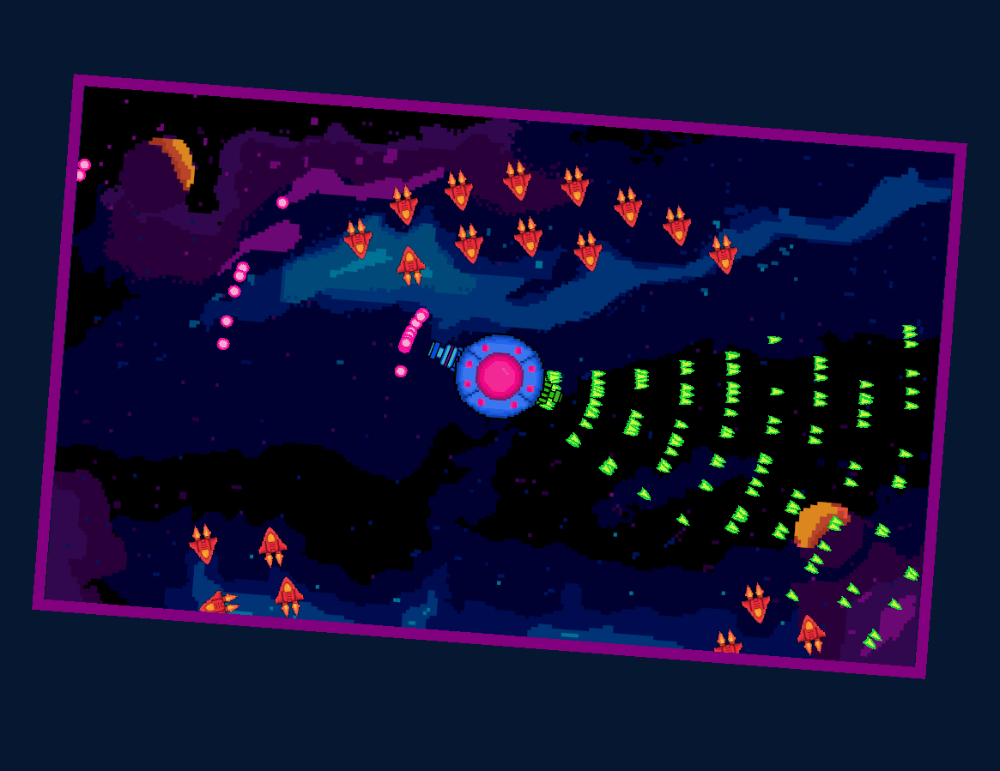
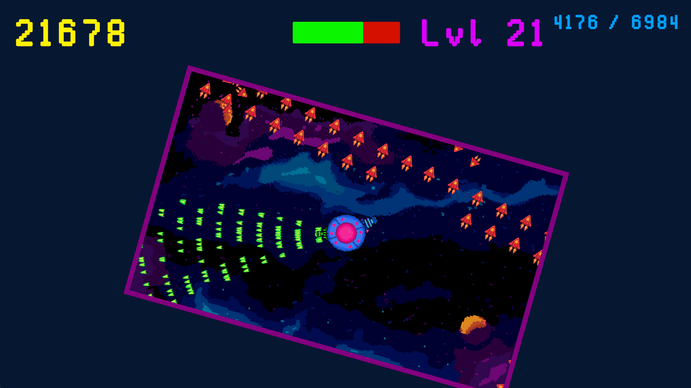

# Try to survive in this bullet hell game, while controlling weapons of your space ship and destroying enemies in this blood masacre! Your only defense is an offense!
## More info here: https://emdemeister.itch.io/pew-pew-panic
### The game was made in 4 days for Bullet Hell 6 Game Jam. We would like to make some changes later on, but the time is gone, sooo we're vibing with what we've got!!!
I would also like to credit:
- Tha Günz for the music
- and my friend, https://github.com/beatkapatzer , for art and some programming of the game

## This game is a bullet hell. But unlike typical bullet hell, the player is the one making a hell for enemies.

## The point of the game is to survive for as long as possible, killing enemies and upgrading his weapons.

## The player cannot move on it’s own and is forced to give up control of the movement.

## HOW TO PLAY:

### 1-2 - Choose Weapon

### A-D - Rotate currently chosen Weapon

### SPACE - Flip the screen (honestly just for fun :D)

### LMB - Choose Card
